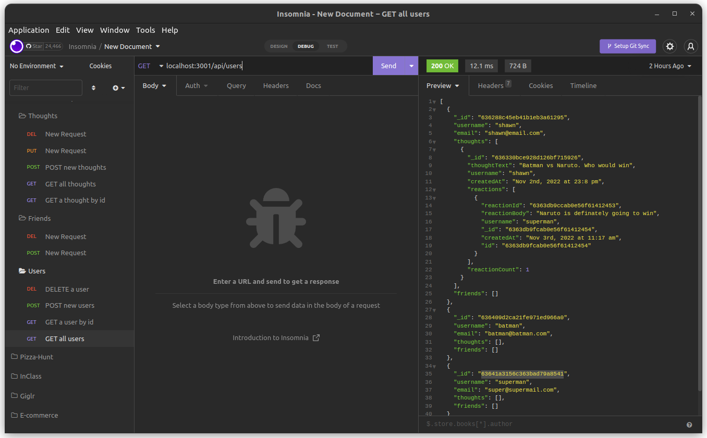

# Social Network API
  


## Description
This application is the back end for a social networking site. It was built using the latest technologies such as Node.js, MongoDB, Mongoose and Express. This application creates the API necessary to perform CRUD operations and update the database.

## Table of Contents
* [Installation](#installation)
* [Usage](#usage)
* [License](#license)
* [Contributing](#contributing)
* [Tests](#tests)
* [Questions](#questions)

## Installation
To install this application run ```npm i```. This will install all the necessary packages.

## Usage
To start the application type ```npm start``` in the terminal from the root of the project file.  

Once the program starts, an API design tool like Insomnia can be used to interact with the database.



A demonstration video of the application can be found [here](https://drive.google.com/file/d/1Y7hzS__JwlnRsbdZLG6xfrHL7OpiVMf3/view?usp=sharing).

## License
This application is available under the GNU General Public License family license.


## Contributing
Currently there is no way to contribute to this project.

## Tests
This application does not utilize any tests.

## Questions
For any questions about the project, please don't hesitate to reach out.
* Link to my Github page : [ShawnMaz](https://github.com/ShawnMaz)
* Email: [shawnmaz@pm.me](mailto:shawnmaz@pm.me)